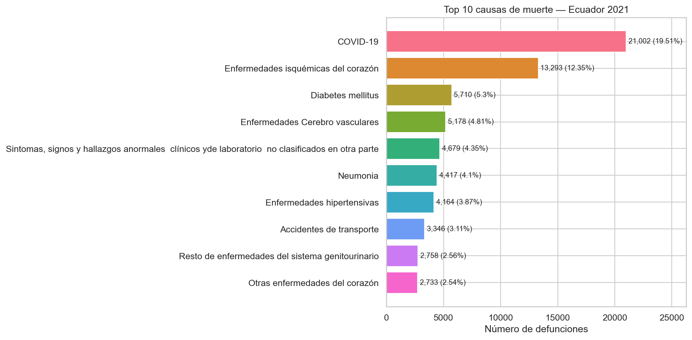
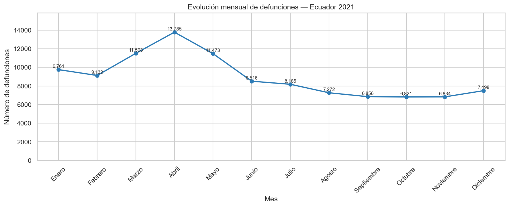
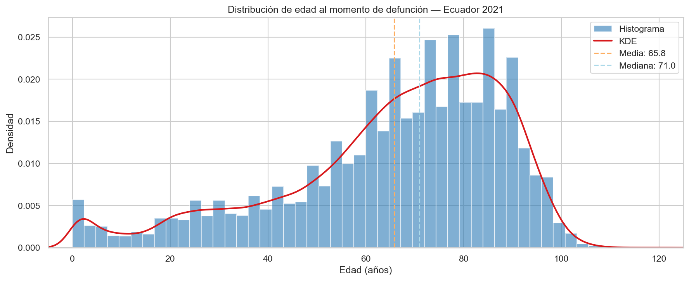

# EDA desde Cero con Datos Sucios — Defunciones Ecuador 2021

> Análisis Exploratorio de Datos completo sobre el Registro Estadístico de Defunciones Generales 2021 del INEC Ecuador: auditoría de calidad, pipeline de limpieza reproducible y exploración con SQL y visualizaciones estadísticas.

[](https://colab.research.google.com/github/Eduardo0602/eda-limpieza-defunciones-ecuador-pandas-sql/blob/main/notebooks/01_auditoria_calidad.ipynb)

---

## Descripción

Este proyecto demuestra el ciclo completo de limpieza y exploración de datos sobre un dataset público real con problemas reales de calidad: valores nulos disfrazados, tipos de datos incorrectos, duplicados semánticos e inconsistencias en fechas.

El objetivo no es construir un modelo — es demostrar la capacidad de convertir datos sucios en datos confiables y documentar cada decisión con rigor. La limpieza y calidad de datos representa aproximadamente el 70% del trabajo real de un Data Analyst; este proyecto evidencia esa habilidad desde la Fase 0 del portafolio.

El proyecto se estructura en tres notebooks que siguen un flujo narrativo: diagnóstico → tratamiento → análisis.

---

## Dataset

| Característica | Detalle |
|---|---|
| **Fuente** | [INEC Ecuador — Registro Estadístico de Defunciones Generales 2021](https://anda.inec.gob.ec/anda/index.php/catalog/930) |
| **Dimensiones originales** | 107,648 filas × 45 columnas |
| **Dimensiones post-limpieza** | 107,641 filas × 58 columnas |
| **Filas eliminadas** | 7 (duplicados exactos confirmados, mayoritariamente neonatales) |
| **Columnas agregadas** | 13 (descomposición de códigos CIE-10, flag de registro tardío) |
| **Problemas de calidad detectados** | ~360,000 celdas con nulos disfrazados, 3 columnas con tipos incorrectos, fechas imposibles, duplicados semánticos |

---

## Fundamento Metodológico

A diferencia de proyectos centrados en modelado, aquí el rigor técnico está en las decisiones de limpieza y en la elección de herramientas analíticas:

**Tratamiento de nulos disfrazados.** Se detectaron ~360,000 celdas con valores como espacios en blanco, "Sin información" y "No aplica" que pandas no reconoce como nulos. Se reemplazaron por `NaN` explícitos y se documentó la decisión de tratamiento para cada columna (imputar, eliminar o conservar como nulo estructural).

**Nulos estructurales vs. datos faltantes.** Las columnas `muj_fertil`, `mor_viol` y `lug_viol` solo aplican a subpoblaciones específicas (mujeres en edad fértil y muertes violentas). Sus nulos no son errores — son la representación correcta de "no aplica". Se conservaron íntegros.

**Elección del coeficiente de correlación.** Se utilizó Spearman ($\rho_s$) en lugar de Pearson ($r$) porque las variables numéricas del dataset son discretas (componentes temporales) con outliers, y Spearman no requiere normalidad ni mide solo relaciones lineales. Se excluyeron los códigos CIE-10 (`cod_causa103`, `cod_causa80`, `cod_causa67B`) de la matriz por ser variables nominales — sus valores numéricos son etiquetas arbitrarias, no magnitudes.

**Estimación de densidad (KDE).** La distribución de edad se visualizó con histograma superpuesto a una curva KDE (Kernel Density Estimation): $\hat{f}(x) = \frac{1}{nh}\sum_{i=1}^{n} K\left(\frac{x - x_i}{h}\right)$. Se acotó el eje X a $[-5, 125]$ para evitar el artefacto visual del kernel gaussiano que genera densidad en edades negativas cuando hay concentración de datos cerca de 0.

---

## Resultados Principales

- **COVID-19 fue la primera causa de muerte** con 21,002 defunciones (19.51%), pero las enfermedades cardiovasculares agrupadas suman 25,368 (23.57%), superando al COVID-19.
- **El pico de abril de 2021** (13,785 defunciones) duplicó la mortalidad del segundo semestre (~7,000/mes), marcando la tercera ola de COVID-19 en Ecuador.
- **Las mujeres fallecen en promedio 5.8 años más tarde que los hombres** (69.1 vs 63.3 años), con 55% más mortalidad masculina por COVID-19.
- **La tasa de mortalidad violenta varía significativamente:** Esmeraldas (12.04%) duplica a Loja (5.00%).







---

## Notebooks

| # | Notebook | Descripción |
|---|---|---|
| 01 | [`01_auditoria_calidad.ipynb`](notebooks/01_auditoria_calidad.ipynb) | Inspección inicial, mapa de nulos, detección de nulos disfrazados, duplicados, inconsistencias de tipos y fechas. Tabla de auditoría con todos los problemas encontrados. |
| 02 | [`02_pipeline_limpieza.ipynb`](notebooks/02_pipeline_limpieza.ipynb) | Pipeline de limpieza reproducible: reemplazo de nulos disfrazados, corrección de tipos, descomposición de códigos CIE-10, validación de fechas. Comparación antes/después. |
| 03 | [`03_analisis_exploratorio_sql.ipynb`](notebooks/03_analisis_exploratorio_sql.ipynb) | Carga a SQLite, 6 consultas SQL analíticas, 9 visualizaciones con interpretación, matriz de correlación de Spearman y conclusiones. |

---

## Estructura del Proyecto
```
eda-limpieza-defunciones-ecuador-pandas-sql/
├── data/
│   ├── raw/                        # Dataset original del INEC (no incluido por tamaño)
│   └── processed/                  # Dataset limpio: defunciones_2021_limpio.csv
├── notebooks/
│   ├── 01_auditoria_calidad.ipynb
│   ├── 02_pipeline_limpieza.ipynb
│   └── 03_analisis_exploratorio_sql.ipynb
├── src/
│   ├── __init__.py
│   ├── data.py
│   ├── features.py
│   └── visualization.py
├── reports/
│   └── figures/                    # 11 visualizaciones exportadas
├── README.md
├── requirements.txt
└── .gitignore
```

---

## Tecnologías


- **Lenguaje:** Python 3.11
- **Manipulación de datos:** Pandas, NumPy
- **Base de datos:** SQLite (en memoria vía sqlite3)
- **Visualización:** Matplotlib, Seaborn
- **Entorno:** Conda (`ds_portafolio`) + JupyterLab
- **Control de versiones:** Git + GitHub

---

## Cómo Reproducir
```bash
# 1. Clonar el repositorio
git clone https://github.com/Eduardo0602/eda-limpieza-defunciones-ecuador-pandas-sql.git
cd eda-limpieza-defunciones-ecuador-pandas-sql

# 2. Crear el entorno con Conda
conda create -n ds_portafolio python=3.11 -y
conda activate ds_portafolio
pip install -r requirements.txt

# 3. Descargar el dataset original del INEC
#    Fuente: https://anda.inec.gob.ec/anda/index.php/catalog/930
#    Colocar el archivo en data/raw/

# 4. Ejecutar los notebooks en orden
jupyter lab
#    Abrir 01 → 02 → 03 y ejecutar Kernel → Restart & Run All en cada uno
```

---

## Lo que Aprendí

1. **La limpieza de datos es la etapa más larga y más importante.** De las tres secciones del proyecto, la auditoría y limpieza consumieron más del 70% del esfuerzo — exactamente la proporción que se reporta en la industria.

2. **Los nulos no siempre son nulos.** Pandas reconoce `NaN` y celdas vacías, pero valores como espacios en blanco, "Sin información" o "No aplica" pasan desapercibidos. Detectarlos requiere inspección manual y criterio sobre el dominio de los datos.

3. **La herramienta estadística se elige antes de aplicarla, no después.** La correlación de Pearson habría producido resultados numéricos sin error técnico, pero metodológicamente incorrectos para variables discretas y códigos nominales. La elección de Spearman y la exclusión de códigos CIE-10 fue una decisión más importante que el cálculo en sí.

4. **SQL y pandas son complementarios, no competidores.** SQL es más expresivo para agrupaciones con filtros complejos y subconsultas; pandas es más natural para transformaciones columna por columna y visualización inmediata.

---

*Proyecto 0.2 del portafolio "De Matemático a Data Scientist" — Fase 0*
