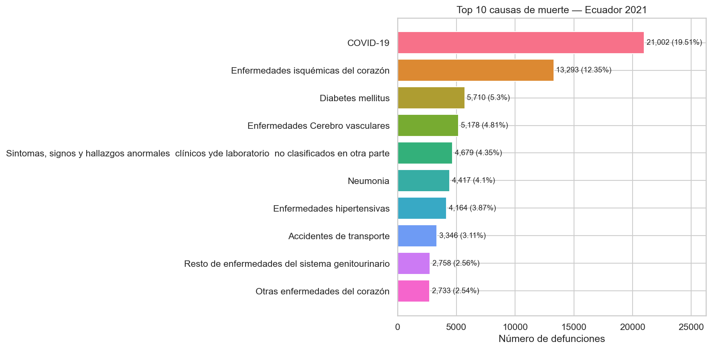
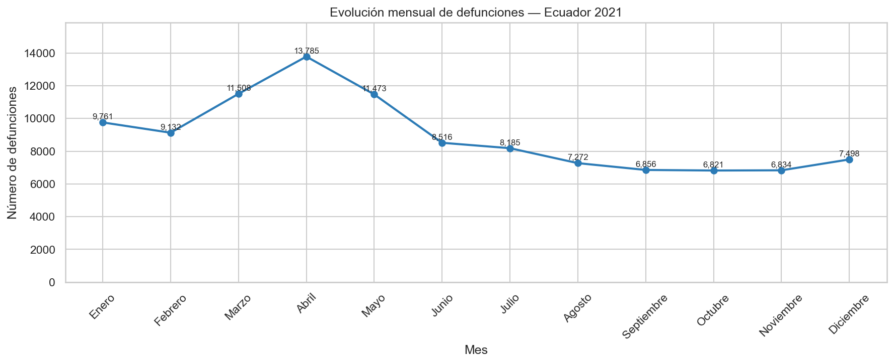

# EDA con datos sucios: qué hay que corregir antes de confiar en un registro oficial

Auditoría de calidad, limpieza reproducible y exploración con SQL del Registro Estadístico de Defunciones Generales 2021 del INEC (107 648 registros).

> **English summary.** Data-quality audit, reproducible cleaning pipeline and SQL-based exploration of Ecuador's official 2021 death registry (107,648 records, 45 columns). The audit found 369,685 disguised missing values, wrong data types, impossible dates and semantic duplicates; every cleaning decision is documented and justified. Correlations use Spearman with nominal ICD-10 codes excluded, because the statistical tool is chosen before it is applied.

     [](https://colab.research.google.com/github/Eduardo0602/eda-limpieza-defunciones-ecuador-pandas-sql/blob/master/notebooks/01_auditoria_calidad.ipynb)

## El problema

Los datos públicos reales rara vez están listos para analizar: tienen nulos que no parecen nulos, tipos incorrectos, duplicados y fechas imposibles. El objetivo aquí no es un modelo, sino convertir datos sucios en datos confiables y documentar cada decisión. El flujo tiene tres etapas: diagnóstico, tratamiento y análisis.

## Datos

| Característica | Detalle |
|---|---|
| Fuente | [INEC Ecuador, Registro Estadístico de Defunciones Generales 2021](https://anda.inec.gob.ec/anda/index.php/catalog/930) |
| Dimensiones originales | 107 648 filas × 45 columnas |
| Dimensiones tras la limpieza | 107 641 filas × 58 columnas |
| Filas eliminadas | 7 (duplicados exactos confirmados, en su mayoría neonatales) |
| Columnas agregadas | 13 (descomposición de códigos CIE-10 y marca de registro tardío) |
| Problemas detectados | 369 685 celdas con nulos disfrazados, 3 columnas con tipos incorrectos, fechas imposibles, duplicados semánticos |

Los datos no se incluyen en el repositorio; se descargan del portal del INEC.

## Fundamento metodológico

**Nulos disfrazados.** Espacios en blanco, "Sin información" o "No aplica" no son reconocidos como nulos por pandas. Se reemplazaron por `NaN` explícitos y se documentó, columna por columna, si se imputaban, eliminaban o conservaban como nulo estructural.

**Nulos estructurales frente a datos faltantes.** `muj_fertil`, `mor_viol` y `lug_viol` solo aplican a subpoblaciones (mujeres en edad fértil, muertes violentas). Sus nulos representan correctamente "no aplica" y se conservaron.

**Elección del coeficiente de correlación.** Se usó Spearman ($`\rho_s`$) en lugar de Pearson ($`r`$): las variables numéricas son discretas (componentes temporales) con valores atípicos, y Spearman no requiere normalidad ni se limita a relaciones lineales. Los códigos CIE-10 (`cod_causa103`, `cod_causa80`, `cod_causa67B`) se excluyeron de la matriz: son etiquetas nominales, no magnitudes.

**Estimación de densidad.** La edad se muestra con histograma y una curva de densidad por núcleos, $`\hat{f}(x) = \frac{1}{nh}\sum_{i=1}^{n} K\left(\frac{x - x_i}{h}\right)`$. El eje se acotó a $`[-5, 125]`$ para no mostrar la densidad artificial en edades negativas que genera el núcleo gaussiano cerca de 0.

## Resultados

- **COVID-19 fue la primera causa individual de muerte** con 21 002 defunciones (19,51 %), aunque las enfermedades cardiovasculares agrupadas suman 25 368 (23,57 %).
- **Abril de 2021** registró 13 785 defunciones, alrededor del doble de los meses del segundo semestre: la tercera ola de COVID-19.
- **Las mujeres fallecen en promedio 5,8 años más tarde que los hombres** (69,1 frente a 63,3 años).
- **La proporción de muertes violentas varía mucho entre provincias** (entre las que registran al menos 2 000 defunciones): Esmeraldas (12,04 %) duplica a Loja (5,00 %). Es una comparación descriptiva, no una prueba de hipótesis.





## Verificación

La función `limpiar_dataset()`, aplicada sobre el dataset crudo, reproduce exactamente el resultado del pipeline ejecutado paso a paso: misma forma (107 641 × 58) y 58 de 58 columnas idénticas. Cada transformación se comprueba además después de ejecutarse en el notebook 02.

## Cómo reproducir

```bash
git clone https://github.com/Eduardo0602/eda-limpieza-defunciones-ecuador-pandas-sql.git
cd eda-limpieza-defunciones-ecuador-pandas-sql
conda create -n ds_portafolio python=3.11 -y
conda activate ds_portafolio
pip install -r requirements.txt
# Descargar el dataset del INEC (https://anda.inec.gob.ec/anda/index.php/catalog/930) y colocarlo en data/raw/
jupyter lab   # abrir 01, 02 y 03 en orden: Kernel → Restart & Run All
```

| Notebook | Contenido |
|---|---|
| [`01_auditoria_calidad.ipynb`](notebooks/01_auditoria_calidad.ipynb) | Mapa de nulos, nulos disfrazados, duplicados, tipos y fechas; tabla de auditoría |
| [`02_pipeline_limpieza.ipynb`](notebooks/02_pipeline_limpieza.ipynb) | Pipeline reproducible: nulos, tipos, códigos CIE-10, fechas; comparación antes y después |
| [`03_analisis_exploratorio_sql.ipynb`](notebooks/03_analisis_exploratorio_sql.ipynb) | Carga a SQLite, 6 consultas analíticas, 9 visualizaciones, correlación de Spearman y conclusiones |

## Estructura del proyecto

```
eda-limpieza-defunciones-ecuador-pandas-sql/
├── data/processed/       # defunciones_2021_limpio.csv (se genera al ejecutar el notebook 02)
├── notebooks/            # 01 → 02 → 03
├── src/                  # data.py, features.py, visualization.py
├── reports/figures/      # 11 figuras
├── requirements.txt
└── LICENSE
```

## Limitaciones

- Es un análisis descriptivo de un año: las diferencias entre grupos no se sometieron a pruebas de hipótesis.
- Las tasas por provincia son proporciones dentro de las defunciones registradas, no tasas poblacionales (no se usaron proyecciones de población).

## Lo que aprendí

1. **La limpieza es la etapa más larga y la más importante.** En este proyecto, la auditoría y la limpieza consumieron la mayor parte del esfuerzo.
2. **Los nulos no siempre son nulos.** Detectar "Sin información" o espacios en blanco requiere inspección manual y conocimiento del dominio.
3. **La herramienta estadística se elige antes de aplicarla.** Pearson habría dado números sin error técnico pero metodológicamente incorrectos; elegir Spearman y excluir códigos nominales importó más que el cálculo.
4. **SQL y pandas se complementan.** SQL es más expresivo para agrupaciones con filtros y subconsultas; pandas, para transformaciones por columna y visualización inmediata.

---

### Portafolio *De Matemático a Data Scientist*

| Proyecto | Pregunta | Herramientas |
|---|---|---|
| [Muestreo complejo con Ser Estudiante](https://github.com/Eduardo0602/muestreo-complejo-ser-estudiante) | ¿Cuánto se equivoca quien ignora el diseño muestral? | R, survey |
| **EDA con datos sucios: defunciones 2021** (este repositorio) | ¿Qué hay que corregir antes de confiar en un registro oficial? | Python, pandas, SQL |
| [Regresión lineal desde cero](https://github.com/Eduardo0602/regresion-lineal-numpy-desde-cero) | ¿Puede un plano predecir la profundidad de los sismos de Ecuador? | Python, NumPy |
| [Álgebra lineal visual](https://github.com/Eduardo0602/algebra-lineal-visual-numpy) | ¿Qué hace geométricamente una matriz? | Python, NumPy |

Eduardo Araque · Matemático (Universidad Central del Ecuador) · [GitHub](https://github.com/Eduardo0602) · [LinkedIn](https://www.linkedin.com/in/eduardo-araque-j%C3%A1come-311b93235)
